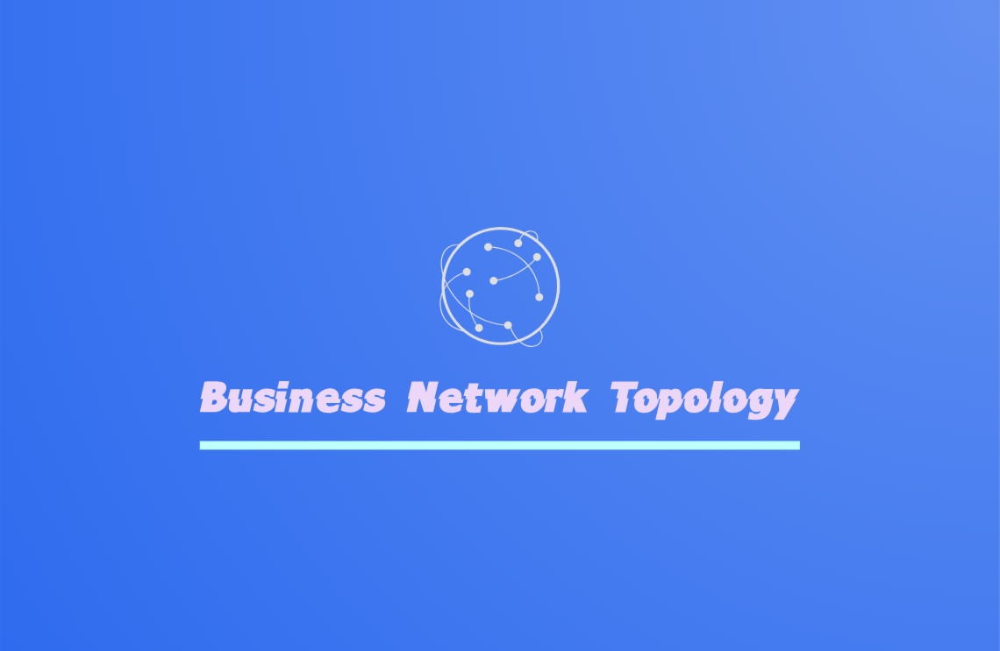
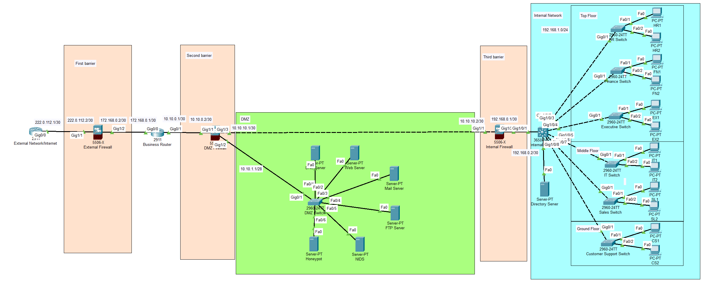

<a id="readme-top"></a>

<!-- PROJECT SHIELDS -->
[![Contributors][contributors-shield]][contributors-url]
[![Forks][forks-shield]][forks-url]
[![Stargazers][stars-shield]][stars-url]
[![Issues][issues-shield]][issues-url]
[![MIT License][license-shield]][license-url]
[![LinkedIn][linkedin-shield]][linkedin-url]

<!-- PROJECT LOGO -->
<br />
<div align="center">
  <a href="https://github.com/vectorete/business-network-topology">
    
  </a>

<h3 align="center">Network Topology Project for IT Consulting Business</h3>

<p align="center">
A packet tracer project that represents a secure network topology design for a medium-small IT consulting business to ensure efficient operations, secure data management, and seamless communication.
    <br />
    <a href="https://github.com/vectorete/business-network-topology"><strong>Explore the docs »</strong></a>
    <br />
    <br />
    <a href="https://github.com/vectorete/business-network-topology">View Demo</a>
    ·
    <a href="https://github.com/vectorete/business-network-topology/issues/new?labels=bug&template=bug-report---.md">Report Bug</a>
    ·
    <a href="https://github.com/vectorete/business-network-topology/issues/new?labels=enhancement&template=feature-request---.md">Request Feature</a>
  </p>
</div>

<!-- TABLE OF CONTENTS -->
<details>
  <summary>Table of Contents</summary>
  <ol>
    <li>
      <a href="#about-the-project">🔎 About The Project</a> ||
      <a href="#business-overview"> 📊 Business Overview</a>
      <ul>
        <li><a href="#features">✨ Features</a></li>
        <li><a href="#built-with">🔨 Built With</a></li>
        <li><a href="#network-topology">🖧 Network Topology</a></li>
        <li><a href="#config-note">📁 Configuration Note </a></li>
      </ul>
    </li>
    <li>
      <a href="#getting-started">🚀 Getting Started</a>
      <ul>
        <li><a href="#prerequisites">📝 Prerequisites</a></li>
        <li>
          <a href="#installation">📥 Installation</a>
        </li>
      </ul>
    </li>
    <li>
      <a href="#security">🛡️ Security</a>
      <ul>
        <li><a href="#logical-security">💡 Logical Security</a></li>
        <li><a href="#physical-security">🔒 Physical Security</a></li>
        <li><a href="#monitoring-maintenance">🧪 Monitoring and Maintenance</a></li>
      </ul>
    </li>
    <li><a href="#possible-improvements">🔧 Possible Improvements</a></li>
    <li><a href="#resources">📚 Resources</a></li>
    <li><a href="#contributing">🤝 Contributing</a></li>
    <li><a href="#license">©️ License</a></li>
    <li><a href="#contact">☎️ Contact</a></li>
  </ol>
</details>

<!-- ABOUT THE PROJECT -->
## 🔎 About The Project <a id="about-the-project"></a>

  <a href="https://github.com/vectorete/business-network-topology">
    
  </a>

The Network Topology Project for the fictional IT Consulting Business is designed to create a secure and efficient network infrastructure for a medium-small business. This setup ensures seamless communication across departments, secure data management, and efficient operation.

### 📊 Business Overview <a id="business-overview"></a>

#### **Industry**: IT Consulting

#### **Number of Employees**: 50

#### **Location**: Single office building with three floors

**Departments and Their Layout**:

- **Top Floor**:
  - **Executive (5 employees)**: Senior management and leadership team.
  - **Finance (10 employees)**: Handles budgeting, accounting, and financial reporting.
  - **HR (5 employees)**: Manages recruitment, employee relations, and benefits.

- **Middle Floor**:
  - **IT (10 employees)**: Responsible for network maintenance, technical support, and IT infrastructure.
  - **Sales (10 employees)**: Manages client relationships, sales strategies, and business development.

- **Ground Floor**:
  - **Customer Support (10 employees)**: Provides assistance to clients, handles inquiries, and manages support tickets.

<p align="right">(<a href="#readme-top">back to top</a>)</p>

### ✨ Features <a id="features"></a>

- **VLAN Segmentation**: Segregates traffic for better security and performance.
- **DMZ Configuration**: Protects external-facing servers while preventing unauthorized access to internal systems.
- **Multiple Firewalls**: Ensures layered security from external threats and internal vulnerabilities.
- **Managed Switches**: Provides control over network traffic and improves scalability.
- **Security Measures**: Includes NIDS, honeypot, and a web application firewall to protect against various threats.

<p align="right">(<a href="#readme-top">back to top</a>)</p>

<!-- BUILT WITH -->
### 🔨 Built With <a id="built-with"></a>
* [![Cisco][Cisco]][Cisco-url]

<p align="right">(<a href="#readme-top">back to top</a>)</p>

### 🖧 Network Topology <a id="network-topology"></a>

The network topology is designed with a layered security approach, ensuring that critical systems are protected from external and internal threats.

**Network Topology**:

#### 1. **External Firewall**
The external firewall serves as the first line of defense, filtering traffic between the internet and the internal network. It blocks unauthorized access and protects against various threats, including DDoS attacks and malware, ensuring a secure perimeter.

#### 2. **VLAN Segmentation**
The network is divided into several VLANs to enhance security and performance by isolating different types of traffic. This segmentation is applied both to the DMZ and the internal network:

- **DMZ VLANs:**
  - **VLAN10:** Dedicated to DNS servers.
  - **VLAN20:** Hosts Web, Mail, and FTP servers, all protected by a Web Application Firewall (WAF).
  - **VLAN30:** Reserved for the honeypot server, which acts as a decoy for potential attackers.
  - **VLAN40:** Contains the Network Intrusion Detection System (NIDS) and monitoring PC for logs.

- **Internal Network VLANs:**
  - **VLAN10:** HR Department.
  - **VLAN20:** Finance Department.
  - **VLAN30:** IT Department.
  - **VLAN40:** Sales Department.
  - **VLAN50:** Monitoring PC for log analysis.

This segmentation reduces the attack surface and prevents unauthorized lateral movement within the network, limiting potential damage in the event of a compromise.

#### 3. **DMZ Firewall and Perimeter Network (DMZ)**
The DMZ firewall secures the perimetrical network where servers exposed to the internet reside. Servers in the DMZ, such as the Web, Mail, and FTP servers, are isolated from the internal network to reduce the risk of a breach spreading. If these servers are compromised, the internal firewall prevents unauthorized access to the internal network, ensuring that critical systems remain protected.

#### 4. **Internal Firewall**
The internal firewall provides an additional layer of security, controlling traffic between the DMZ and the internal network. This redundancy is crucial, especially if the DMZ firewall is compromised, ensuring that even with a breach, attackers would face significant obstacles before accessing sensitive internal systems.

#### 5. **Layer 3 Switch**
The Layer 3 switch handles inter-VLAN routing, facilitating communication between different departments while maintaining security boundaries. Access control lists (ACLs) enforce security policies across the network, allowing for efficient operations without compromising security.

<hr>

**Conclusion**

This network topology design employs a defense-in-depth strategy, with multiple layers of security protecting the organization's critical systems. By placing servers in a DMZ and using VLAN segmentation alongside external and internal firewalls, the design ensures that the internal network remains secure, even in the event of a server compromise. This setup is essential for maintaining the integrity and availability of the business's operations.

<hr>

<p align="right">(<a href="#readme-top">back to top</a>)</p>

### 📁 Configuration Note <a id="config-note"></a>

There is a configuration file included in the project repository named `topology.txt` that details the entire network setup. This file provides a comprehensive view of the network configuration, including specific settings for devices and interfaces.

**Important Note**:
- The Cisco Packet Tracer file included in this repository does not fully replicate the configuration outlined in `topology.txt`. This limitation is due to Packet Tracer's inability to support certain advanced features, such as dividing the interface in the Cisco Firewall ASA connected to the DMZ switch into subinterfaces.
- The `topology.txt` file contains the complete setup, including these advanced configurations that are not represented in Packet Tracer. For a full understanding of the network configuration, please refer to this file.

To access the configuration file, download it from the repository:
- [topology.txt](topology.txt)

<p align="right">(<a href="#readme-top">back to top</a>)</p>

<!-- GETTING STARTED -->
## 🚀 Getting Started <a id="getting-started"></a>

To get a local copy up and running, follow these simple steps.

### 📝 Prerequisites <a id="prerequisites"></a>

* Cisco Packet Tracer (I recommend the last version)

<p align="right">(<a href="#readme-top">back to top</a>)</p>

### 📥 Installation <a id="installation"></a>

1. **Clone the repository**:
    ```sh
    git clone https://github.com/vectorete/business-network-topology.git
    ```

2. **Open the project file**:
    - Navigate to the cloned repository folder.
    - Open the `.pkt` file with Cisco Packet Tracer.

That's it! The network topology will load in Packet Tracer, and you can start exploring or modifying the design.

<p align="right">(<a href="#readme-top">back to top</a>)</p>

<!-- SECURITY ADVICES -->
## 🛡️ Security <a id="security"></a>
### 💡 Logical Security <a id="logical-security"></a>
- **Host Intrusion Detection System (HIDS)**: Deploy a HIDS, such as OSSEC, to monitor and analyze activities on individual hosts. It helps detect suspicious behavior, unauthorized access attempts, and potential security breaches at the host level.
  
- **Network Intrusion Detection System (NIDS)**: Implement a NIDS, like SNORT, to continuously monitor network traffic for malicious activities or policy violations. It provides real-time alerts on suspicious network behavior and potential attacks.

- **Web Application Firewall (WAF)**: Use a WAF, such as Cloudflare, to protect web applications from various threats and vulnerabilities. The WAF filters and monitors HTTP requests, blocking malicious traffic and mitigating attacks such as SQL injection, cross-site scripting (XSS), and cross-site request forgery (CSRF).

- **Honeypot**: Utilize a Honeypot, such as Dionaea, to attract and deceive attackers. This decoy system helps to gather intelligence on attack methods and tools, thereby improving overall security measures and threat detection.

- **Log Management and Observability Platforms**: Use platforms like Splunk or ELK Stack to collect, analyze, and visualize log data. This helps in monitoring system activities, identifying anomalies, and generating actionable insights for security incidents.

- **Secure Passwords**: Enforce the use of strong, complex passwords to make them resistant to brute-force attacks. Utilize tools such as the [Password Checker](https://password.kaspersky.com) to evaluate and strengthen password security.

- **Awareness Program and Employee Training**: Implement an ongoing security awareness program to educate employees about security best practices and common threats. Human error is a major factor in data breaches, so training helps reduce the risk of phishing and other social engineering attacks.

- **Manual Backup**: Regularly perform manual backups of critical data to ensure that important information is not lost in case of system failures or attacks. This adds an extra layer of protection against data loss.

<p align="right">(<a href="#readme-top">back to top</a>)</p>

### 🔒 Physical Security <a id="physical-security"></a>
- **CCTV Cameras**: Install surveillance cameras in strategic locations to monitor and record activities around sensitive areas, enhancing security and deterrence against unauthorized access.

- **Biometric Access Control**: Use biometric systems, such as fingerprint or retina scanners, for restricted access to server rooms and other secure areas. This ensures that only authorized personnel can enter critical locations.

- **Fire Protection System**: Equip the facility with a comprehensive fire protection system, including alarms and suppression systems, to safeguard against fire hazards and protect critical infrastructure.

- **Uninterruptible Power Supply (UPS)**: Implement UPS systems to provide backup power during outages, ensuring continuous operation of critical systems and preventing data loss or hardware damage.

- **Security Guard**: Employ a security guard to provide physical security, conduct regular patrols, and respond to security incidents. Their presence enhances overall security and provides a quick response to potential threats.

<p align="right">(<a href="#readme-top">back to top</a>)</p>

## 🧪 Monitoring and Maintenance <a id="monitoring-maintenance"></a>
- **Monitor NIDS Alerts**: Regularly check the Network Intrusion Detection System for any suspicious activity.

- **Honeypot Analysis**: Analyze data captured by the honeypot to learn from the attackers and see what are their pattern of attacks.

- **Log Management**: Use monitoring PCs to review and archive logs from various network components.

<p align="right">(<a href="#readme-top">back to top</a>)</p>

<!-- IMPROVEMENTS -->
## 🔧 Possible Improvements <a id="possible-improvements"></a>

In the current Packet Tracer project, VPN configuration and RADIUS server setup are not yet completed. Implementing a VPN will provide secure remote access and encrypted communication, while configuring the RADIUS server will enhance centralized authentication and access control within the internal network.

<p align="right">(<a href="#readme-top">back to top</a>)</p>

<!-- RESOURCES -->
## 📚 Resources <a id="resources"></a>

Here are some additional resources that you may find useful:

### 🗃️ Documentation and Tools
- **[Cisco Packet Tracer Documentation](https://www.netacad.com/courses/packet-tracer)**: Official documentation and tutorials for using Cisco Packet Tracer.
- **[Cisco Official Website](https://www.cisco.com)**: Explore Cisco’s range of networking products and solutions.
- **[Splunk](https://www.splunk.com)**: A powerful platform for searching, monitoring, and analyzing machine-generated data via a web-style interface. It’s widely used for log management and operational intelligence.
- **[ELK Stack](https://www.elastic.co/what-is/elk-stack)**: A combination of Elasticsearch, Logstash, and Kibana, used for searching, analyzing, and visualizing log data in real-time. It’s a popular choice for log management and data analysis.
- **[Kaspersky Password Checker](https://password.kaspersky.com)**: An online tool for evaluating the strength of passwords and ensuring they are resistant to brute-force attacks.
- **[Snort](https://www.snort.org)**: An open-source Network Intrusion Detection System (NIDS) that performs real-time traffic analysis and packet logging to detect and prevent attacks.
- **[OSSEC](https://www.ossec.net)**: An open-source Host Intrusion Detection System (HIDS) that provides log analysis, file integrity checking, and real-time alerts.
- **[Cloudflare](https://www.cloudflare.com)**: A web security and performance company that offers services such as a Web Application Firewall (WAF), DDoS protection, and content delivery.
- **[Dionaea](https://github.com/DinoTools/dionaea)**: A honeypot designed to capture and analyze malware, providing insights into attack methods and tools used by attackers.

### ✅ Security Best Practices
- **[OWASP (Open Web Application Security Project)](https://owasp.org)**: Comprehensive resources on web application security.
- **[NIST Cybersecurity Framework](https://www.nist.gov/cyberframework)**: Guidelines and best practices for improving cybersecurity.

### 🆘 Community and Support
- **[Cisco Community](https://community.cisco.com)**: A forum for discussing Cisco products and networking topics.
- **[Reddit r/networking](https://www.reddit.com/r/networking)**: A subreddit for network-related discussions and questions.
- **[Stack Overflow](https://stackoverflow.com/questions/tagged/networking)**: Q&A site for programming and network-related queries.

<p align="right">(<a href="#readme-top">back to top</a>)</p>

<!-- CONTRIBUTING -->
## 🤝 Contributing <a id="contributing"></a>

Contributions are what make the open-source community such an amazing place to learn, inspire, and create. Any contributions you make are **greatly appreciated**.

If you have a suggestion that would make this better, please fork the repo and create a pull request. You can also simply open an issue with the tag "enhancement". Don't forget to give the project a star! Thanks again!

1. Fork the Project
2. Create your Feature Branch (`git checkout -b feature/AmazingFeature`)
3. Commit your Changes (`git commit -m 'Add some AmazingFeature'`)
4. Push to the Branch (`git push origin feature/AmazingFeature`)
5. Open a Pull Request

<p align="right">(<a href="#readme-top">back to top</a>)</p>

<!-- LICENSE -->
## ©️ License <a id="license"></a>

Distributed under the MIT License. See `LICENSE.txt` for more information.

<p align="right">(<a href="#readme-top">back to top</a>)</p>

<!-- CONTACT -->
## ☎️ Contact <a id="contact"></a>

Victor Kravchuk Vorkevych - victorkravchuk19@gmail.com

Project Link: [https://github.com/vectorete/business-network-topology](https://github.com/vectorete/business-network-topology)

<p align="right">(<a href="#readme-top">back to top</a>)</p>

<!-- MARKDOWN LINKS & IMAGES -->
<!-- https://www.markdownguide.org/basic-syntax/#reference-style-links -->
[contributors-shield]: https://img.shields.io/github/contributors/vectorete/business-network-topology.svg?style=for-the-badge
[contributors-url]: https://github.com/vectorete/business-network-topology/graphs/contributors
[forks-shield]: https://img.shields.io/github/forks/vectorete/business-network-topology.svg?style=for-the-badge
[forks-url]: https://github.com/vectorete/business-network-topology/network/members
[stars-shield]: https://img.shields.io/github/stars/vectorete/business-network-topology.svg?style=for-the-badge
[stars-url]: https://github.com/vectorete/business-network-topology/stargazers
[issues-shield]: https://img.shields.io/github/issues/vectorete/business-network-topology.svg?style=for-the-badge
[issues-url]: https://github.com/vectorete/business-network-topology/issues
[license-shield]: https://img.shields.io/github/license/vectorete/business-network-topology.svg?style=for-the-badge
[license-url]: https://github.com/vectorete/business-network-topology/blob/master/LICENSE.txt
[linkedin-shield]: https://img.shields.io/badge/-LinkedIn-black.svg?style=for-the-badge&logo=linkedin&colorB=555
[linkedin-url]: https://linkedin.com/in/vectorete
[product-project]: images/projectimg.png
[Cisco]: https://img.shields.io/badge/Cisco-1BA0D7?style=for-the-badge&logo=cisco&logoColor=white
[Cisco-url]: https://www.cisco.com
